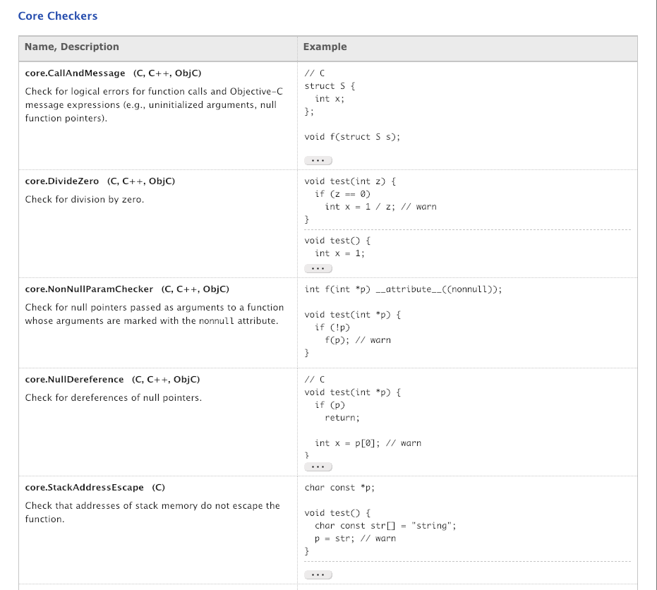
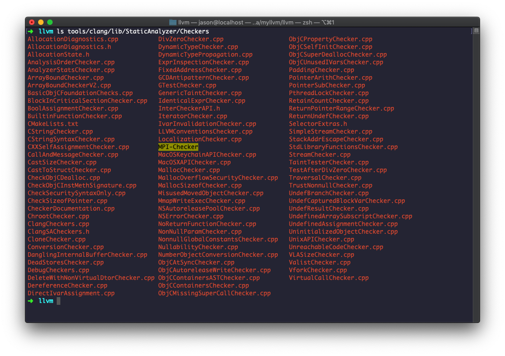
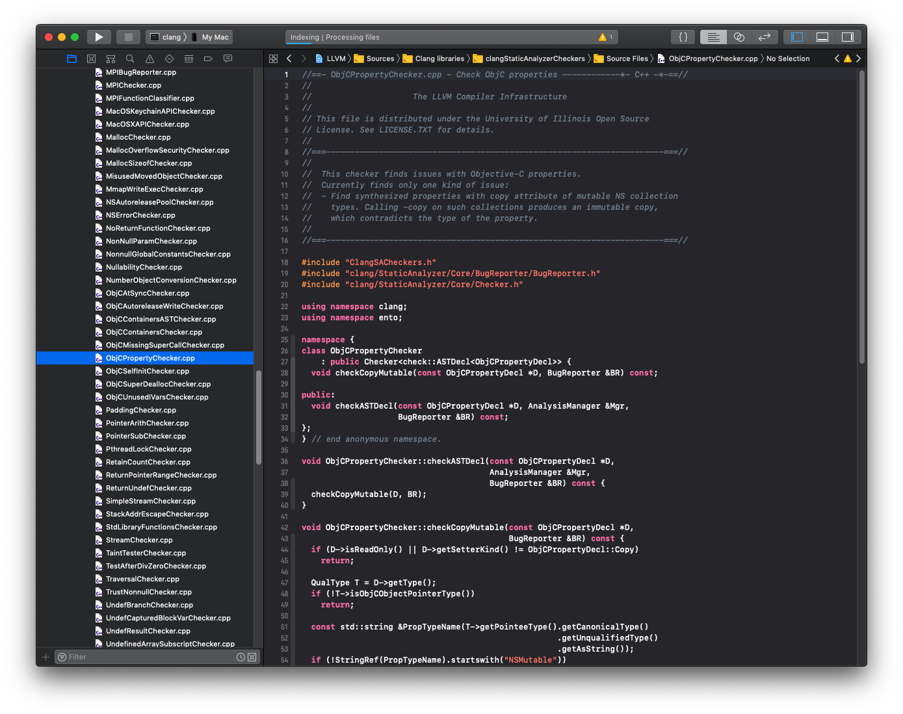
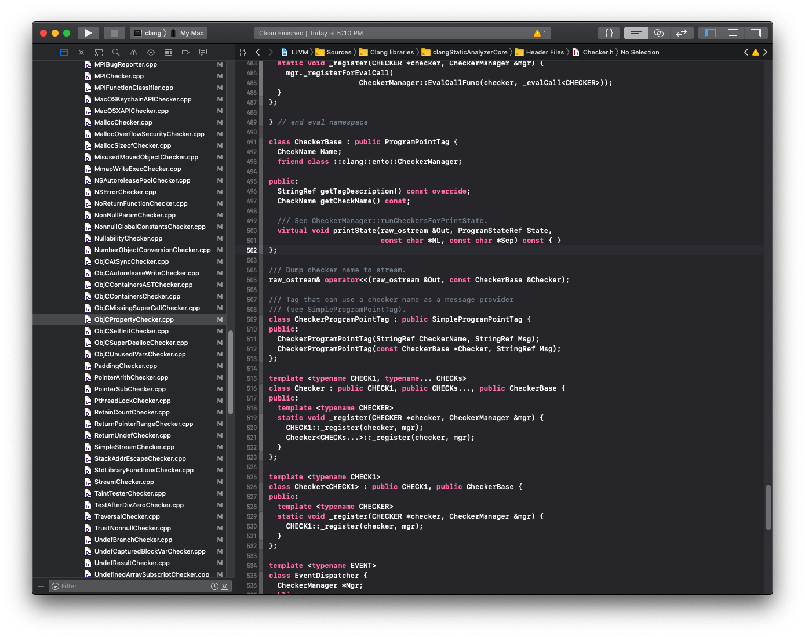
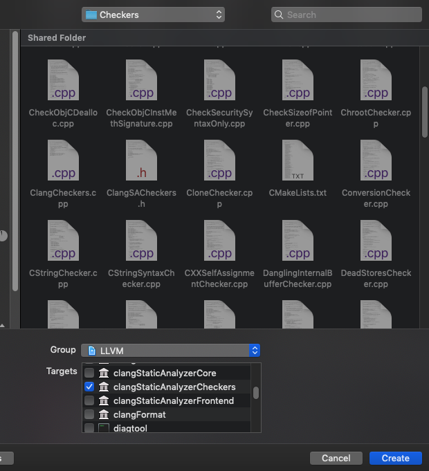
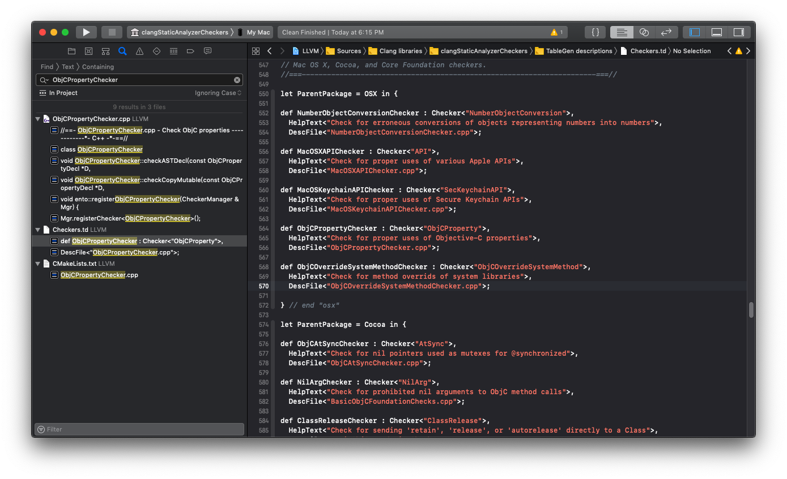
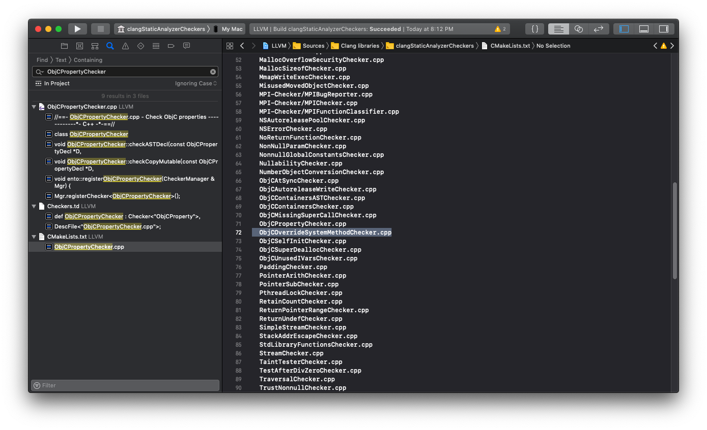
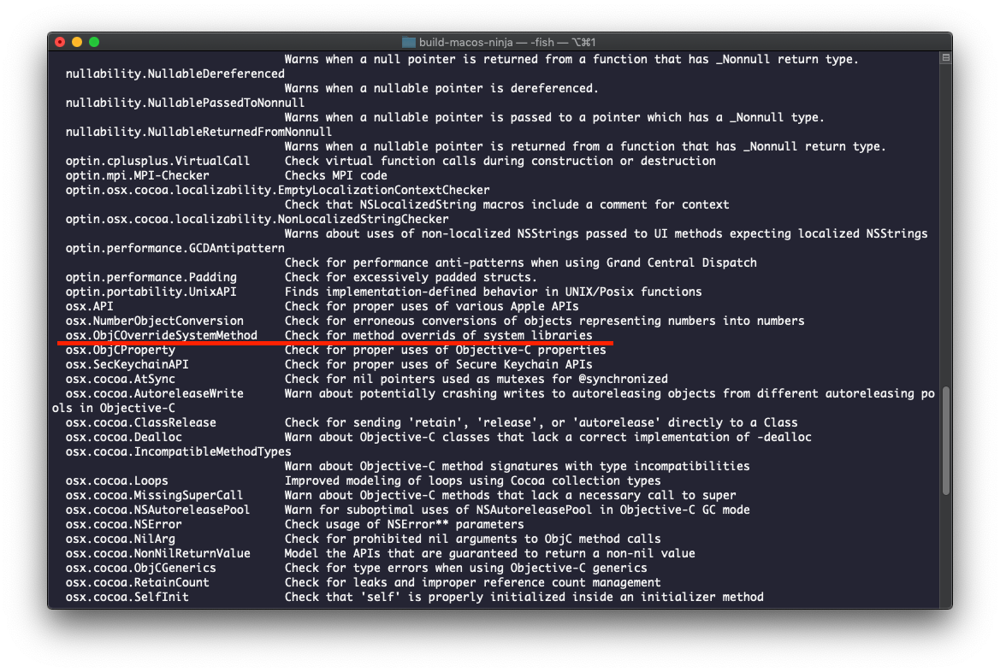
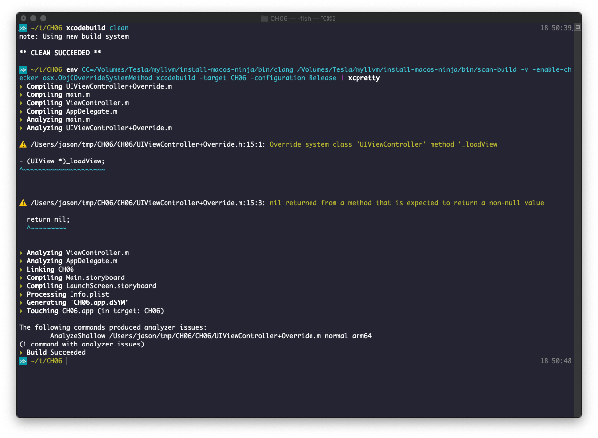

# 第六章 自制静态检查器

## 为什么要自制检查器

上一章我们介绍了静态分析器的原理和使用方法，编译器自带了不少有价值的分析器。



系统自带的检查器远不止这些，你可以通过官方文档来查看。

[https://clang-analyzer.llvm.org/available_checks.html](https://clang-analyzer.llvm.org/available_checks.html)

不过有时候我们在应用开发过程中会有一些自己的忌讳，内置分析器往往无法满足我们的个性化需求。比如在笔者在工作中就犯过这样的错误，为了实现一个功能而给系统库的类添加 Category 并添加了自己的方法，但碰巧这个方法是系统库的私有方法，最后导致一个非常难排查的问题。

于是后来我们团队中就形成这样的惯例，只要是给系统类添加方法，就一定要加上自己的前缀，但有些新人不一定非常了解，就算有 review 的环节，人也总是靠不住的，更好的办法是通过机器自动检查出来。

如果我们手写一些针对性的检查脚本，对源代码进行分析，开发难度是比较大的，而且可靠性值得商榷。通过本章的学习，我们将掌握一种更简单可靠的方式，开发自己的静态检查器。

## 解剖内置检查器的源代码

要想开发自己的检查器又不知道从哪里下手，最好的办法也许就是向内置检查器的源代码请教了。只要我们搞清楚了别人的检查器怎么写的，举一反三应该就不难了。那我们先看一下内置的检查器是什么样子吧。



内置的静态检查器在 clang 源代码的目录位置如上图所示。我们以其中一个名为 ObjCPropertyChecker 的检查器为例来介绍。



在第4章我们介绍了如何使用 Xcode 查看 LLVM 和 Clang 的源代码，这里就派上用场了。

这里我们先读一下这个检查器的注释部分

```
//  This checker finds issues with Objective-C properties.
//  Currently finds only one kind of issue:
//  - Find synthesized properties with copy attribute of mutable NS collection
//    types. Calling -copy on such collections produces an immutable copy,
//    which contradicts the type of the property.
```

通过注释我们了解到该检查器的作用很单一：检查 NSMutalble 开头的那些系统库提供的可变容器类型的属性不能使用 copy 作为修饰，因为 copy 方法会生成一个不可变的容器。

下面看一下检查器类的定义部分

```c++
namespace {
class ObjCPropertyChecker
    : public Checker<check::ASTDecl<ObjCPropertyDecl>> {
  void checkCopyMutable(const ObjCPropertyDecl *D, BugReporter &BR) const;

public:
  void checkASTDecl(const ObjCPropertyDecl *D, AnalysisManager &Mgr,
                    BugReporter &BR) const;
};
} // end anonymous namespace.

// ...


void ento::registerObjCPropertyChecker(CheckerManager &Mgr) {
  Mgr.registerChecker<ObjCPropertyChecker>();
}
```

这是一个 C++ 的类，使用了两个模板来生成一个特定的类定义，为了搞清楚这两个模板我们查看一下父类 Checker 的定义。

> 注：模板是 C++ 中至关重要的概念，原理有点类似 C 语言“宏”，会在使用的地方生成一个新的类或者函数。



我们找到 Checker.h 文件，往下一直找到类 Checker<CHECK1> 的定义。

```c++
namespace check {

template <typename DECL>
class ASTDecl {
  template <typename CHECKER>
  static void _checkDecl(void *checker, const Decl *D, AnalysisManager& mgr, BugReporter &BR) {
    ((const CHECKER *)checker)->checkASTDecl(cast<DECL>(D), mgr, BR);
  }

  static bool _handlesDecl(const Decl *D) {
    return isa<DECL>(D);
  }
public:
  template <typename CHECKER>
  static void _register(CHECKER *checker, CheckerManager &mgr) {
    mgr._registerForDecl(CheckerManager::CheckDeclFunc(checker, _checkDecl<CHECKER>), _handlesDecl);

// ...

class CheckerBase : public ProgramPointTag {
  CheckName Name;
  friend class ::clang::ento::CheckerManager;

public:
  StringRef getTagDescription() const override;
  CheckName getCheckName() const;

  /// See CheckerManager::runCheckersForPrintState.
  virtual void printState(raw_ostream &Out, ProgramStateRef State,
                          const char *NL, const char *Sep) const { }
};
// ....

template <typename CHECK1>
class Checker<CHECK1> : public CHECK1, public CheckerBase {
public:
  template <typename CHECKER>
  static void _register(CHECKER *checker, CheckerManager &mgr) {
    CHECK1::_register(checker, mgr);
  }
};
```

可以看到，class Checker<CHECK1> 有两个父类 CHECK1 和 CheckerBase。其中 CheckerBase 是一个通用的父类，包含一些基本的功能。CHECK1 是声明变量或者子类化的时候自定义的类型，我们这里的检查器 ObjCPropertyChecker 自定义的 CHECK1 是 <check::ASTDecl<ObjCPropertyDecl>>。这里我们注意到 CHECK1 的定义里也使用了两个模板 DECL 和 CHECKER，其中 DECL 好理解，它对应于 <ObjCPropertyDecl>，而 CHECKER 的定义在最后的函数 registerObjCPropertyChecker 中，就是 <ObjCPropertyChecker>。

对应清楚了模板，我们再看检查器里定义的两个函数

```c++
void checkCopyMutable(const ObjCPropertyDecl *D, BugReporter &BR) const;

public:
  void checkASTDecl(const ObjCPropertyDecl *D, AnalysisManager &Mgr,
                    BugReporter &BR) const;

void ObjCPropertyChecker::checkASTDecl(const ObjCPropertyDecl *D,
                                       AnalysisManager &Mgr,
                                       BugReporter &BR) const {
  checkCopyMutable(D, BR);
}
```

其中 checkASTDecl 调用了 checkCopyMutable，核心逻辑都在 checkCopyMutable 里面。而 checkASTDecl 是被谁调用的呢？我们回头看一下类 ASTDecl，其中方法 _checkDecl 调用了 checkASTDecl，参数是通过模板的方式传进去的。

检查器类定义好了，但是 Clang 并不知道，需要有一个注册的过程，就是在函数 registerObjCPropertyChecker 里完成的，这个函数是由 ASTDecl 的 _register 方法完成的调用，而这个方法是通过模板 <CHECKER> 来知道调用哪个函数的。
下面看下这个检查器的核心逻辑是如何实现的吧。

```c++
void ObjCPropertyChecker::checkCopyMutable(const ObjCPropertyDecl *D,
                                           BugReporter &BR) const {
  if (D->isReadOnly() || D->getSetterKind() != ObjCPropertyDecl::Copy)
    return;

  QualType T = D->getType();
  if (!T->isObjCObjectPointerType())
    return;

  const std::string &PropTypeName(T->getPointeeType().getCanonicalType()
                                                   .getUnqualifiedType()
                                                     .getAsString());
  if (!StringRef(PropTypeName).startswith("NSMutable"))
    return;

  const ObjCImplDecl *ImplD = nullptr;
  if (const ObjCInterfaceDecl *IntD =
          dyn_cast<ObjCInterfaceDecl>(D->getDeclContext())) {
    ImplD = IntD->getImplementation();
  } else if (auto *CatD = dyn_cast<ObjCCategoryDecl>(D->getDeclContext())) {
    ImplD = CatD->getClassInterface()->getImplementation();
  }

  if (!ImplD || ImplD->HasUserDeclaredSetterMethod(D))
    return;

  SmallString<128> Str;
  llvm::raw_svector_ostream OS(Str);
  OS << "Property of mutable type '" << PropTypeName
     << "' has 'copy' attribute; an immutable object will be stored instead";

  BR.EmitBasicReport(
      D, this, "Objective-C property misuse", "Logic error", OS.str(),
      PathDiagnosticLocation::createBegin(D, BR.getSourceManager()),
      D->getSourceRange());
}
```

1. 排除掉只读属性和非copy属性

```c++
  if (D->isReadOnly() || D->getSetterKind() != ObjCPropertyDecl::Copy)
    return;
```

我们知道 ObjC 的属性有多个纬度，可读写是一个纬度，内存访问策略是另一个纬度。这里忽略了只读，因为 copy 是针对 setter 方法的，只读属性没有 setter 方法。忽略非 copy 方法就不解释了。

2. 排除掉非 ObjC 对象指针类型

```
  QualType T = D->getType();
  if (!T->isObjCObjectPointerType())
    return;
```

这个检查器是针对的属性 ObjC 容器类型的，那自然也是 ObjC 对象指针类型，进一步限制范围。

3. 忽略不以 NSMutalbe 开头的类型

```c++
  const std::string &PropTypeName(T->getPointeeType().getCanonicalType()
                                                   .getUnqualifiedType()
                                                     .getAsString());
  if (!StringRef(PropTypeName).startswith("NSMutable"))
    return;
```

这里通过一连串的方法调用获得了类型名称，再通过字符串匹配判断是否以 NSMutable 开头。

4. 忽略自定义 setter 的情况

```c++
  const ObjCImplDecl *ImplD = nullptr;
  if (const ObjCInterfaceDecl *IntD =
          dyn_cast<ObjCInterfaceDecl>(D->getDeclContext())) {
    ImplD = IntD->getImplementation();
  } else if (auto *CatD = dyn_cast<ObjCCategoryDecl>(D->getDeclContext())) {
    ImplD = CatD->getClassInterface()->getImplementation();
  }

  if (!ImplD || ImplD->HasUserDeclaredSetterMethod(D))
    return;
```

之所以要过滤掉自定义 setter 方法的情况是因为此时 copy 属性是没有实际作用的，它是给编译器生成 setter 方法的时候作为参考用的。

我们知道 ObjC 的类分为定义和实现两部分，而 setter 方法是在实现部分定义的，不过实现部分有两种情况，一种是正常的类定义，另一种是对现有类的扩展定义 Category 。这里考虑了两种情况，分别用 ObjCInterfaceDecl 和 ObjCCategoryDecl 作为声明部分，找到对应的实现部分 ObjCImplDecl，最后做 HasUserDeclaredSetterMethod 的判定。

5. 生成报告

```c++
  SmallString<128> Str;
  llvm::raw_svector_ostream OS(Str);
  OS << "Property of mutable type '" << PropTypeName
     << "' has 'copy' attribute; an immutable object will be stored instead";

  BR.EmitBasicReport(
      D, this, "Objective-C property misuse", "Logic error", OS.str(),
      PathDiagnosticLocation::createBegin(D, BR.getSourceManager()),
      D->getSourceRange());
```

排除掉前面4种情况，最后剩下的就是千辛万苦要找的错误情况了。这里先是通过流来构造了错误信息的字符串，再调用 LLVM 的 API BR.EmitBasicReport 方法生成错误报告。

## 开发自己的检查器

刚才解剖了一个内置检查器，有了它作为参考，我们开发自己的检查器就简单多了，至少知道该从哪里下手了吧。回顾下我们要开发的检查器的功能是：找出针对系统类的 Category 中定义的不包含特定前缀的方法。我们把问题拆解一下：

1. 定义一个可以检查方法声明的检查器类

这个可以模仿刚才我们解剖的内置检查器，只要把类定义中的模板名称 ObjCPropertyDecl 换成方法声明 ObjCMethodDecl 就可以了。

2. 实现一个检查方法声明的函数

同样是模仿它，我们定义一个自己的检查函数就可以了。

3. 判定方法定义是否存在于一个 Category 中

ObjCPropertyChecker 中也有类似的检查方法。

4. 获取 Category 扩展的类名称

这需要查询一下对应类的头文件，或者猜也能知道，一般语法定义的类都有 getName() 方法。

5. 判定类的名称是否是系统类

这个判定需要我们自己来做，笔者的做法是通过类名的前缀是否是 NS、UI 等开头来判定，这样虽然不是特别准确，但一般来说是够用的，如果觉得不足，可以随时再添加。

6. 获取声明的方法的名称

类似的，我们也可以通过 getName() 函数来得到。

7. 判定方法名称是否带有特定的前缀

我们这里就假定前缀是 play_ 吧。

8. 生成错误报告

这部分也模仿内置检查器。

9. 注册检查器

这些代码并不多，我们就不一步一步带着你写了，就一次性把代码全放出来吧。

```objc
//
//  ObjCOverrideSystemMethodChecker2.cpp
//  clangStaticAnalyzerCheckers
//
//  Created by Jason Hsu on 2018/12/16.
//


#include "ClangSACheckers.h"
#include "clang/StaticAnalyzer/Core/BugReporter/BugReporter.h"
#include "clang/StaticAnalyzer/Core/Checker.h"

using namespace clang;
using namespace ento;

namespace {
  class ObjCOverrideSystemMethodChecker
  : public Checker<check::ASTDecl<ObjCMethodDecl>> {
    void checkOverrideSystemMethod(const ObjCMethodDecl *D, BugReporter &BR) const;

  public:
    void checkASTDecl(const ObjCMethodDecl *D, AnalysisManager &Mgr,
                      BugReporter &BR) const;
  };
} // end anonymous namespace.

void ObjCOverrideSystemMethodChecker::checkASTDecl(const ObjCMethodDecl *D,
                                                   AnalysisManager &Mgr,
                                                   BugReporter &BR) const {
  checkOverrideSystemMethod(D, BR);
}

void ObjCOverrideSystemMethodChecker::checkOverrideSystemMethod(const ObjCMethodDecl *D,
                                                                BugReporter &BR) const {

  if (auto *CatD = dyn_cast<ObjCCategoryDecl>(D->getDeclContext())) {
    auto *IntD = D->getClassInterface();
    StringRef ClassName = IntD->getName();
    if (!ClassName.startswith("UI")
        && !ClassName.startswith("NS")) {
      return;
    }

    StringRef MethodName = D->getName();
    if (MethodName.startswith("play_")) {
      return;
    }

    SmallString<128> Str;
    llvm::raw_svector_ostream OS(Str);
    OS << "Override system class '" << IntD->getNameAsString()
    << "' method '" << D->getNameAsString();

    BR.EmitBasicReport(D, this, "System method overriden", "Logic error", OS.str(),
                       PathDiagnosticLocation::createBegin(D, BR.getSourceManager()),
                       D->getSourceRange());
  }
}

void ento::registerObjCOverrideSystemMethodChecker(CheckerManager &Mgr) {
  Mgr.registerChecker<ObjCOverrideSystemMethodChecker>();
}
```

我们把新写的检查器文件放在于内置检查器同一目录中，并选择 Target 为 clangStaticAnalyzerChckers。



最后还有一件事情很容易忽略，虽然我们把代码写好了，但是有两个配置没有配。怎么配置呢？还是老办法，我们看下内置的检查器是怎么配的，我们全局搜索一下 ObjCPropertyChecker。
我们发现除了代码本身，还有两个文件包含了这个关键字。其中一个是 CMakeLists.txt，这个是 CMake 的配置文件，用于告诉 CMake 有哪些代码需要编译。另一个是 Chekcers.td，这个是分析器驱动的配置文件，用于告诉 Clang 有哪些检查器。那我们依葫芦画瓢，把我们新写的的检查器配置也进去。





好了，我们编译出来看一看有没有生效吧，还是用前一章的命令

```bash
$ /Volumes/Tesla/myllvm/install-macos-ninja/bin/clang -cc1 -analyzer-checker-help
```



## 检验检查器是否生效

接下来我们需要一个测试代码来做验证，看看我们新写的检查器是否可用。我们在 Xcode 中新建一个 iOS 应用工程，然后给 UIViewController 编写一个 Category。

声明部分：

```objc
//
//  UIViewController+Override.h
//  CH06
//
//  Created by Jason Hsu on 2018/12/15.
//  Copyright © 2018 Jason Hsu. All rights reserved.
//

#import <UIKit/UIKit.h>

NS_ASSUME_NONNULL_BEGIN

@interface UIViewController (Override)

- (UIView *)_loadView;

@end

NS_ASSUME_NONNULL_END
```

实现部分：

```objc
//
//  UIViewController+Override.m
//  CH06
//
//  Created by Jason Hsu on 2018/12/15.
//  Copyright © 2018 Jason Hsu. All rights reserved.
//

#import "UIViewController+Override.h"

@implementation UIViewController (Override)

- (UIView *)_loadView
{
  return nil;
}

@end
```

回归上一章在命令行中编译 Xcode 工程的方法，这里用 scan-build 运行分析器应该就可以得到如下的效果了。



> 注：scan-build 自己声称是可以自动匹配跟自己同目录的 clang 的，笔者实测是不行的，需要我们手动指定 CC 环境变量。

本章完。


